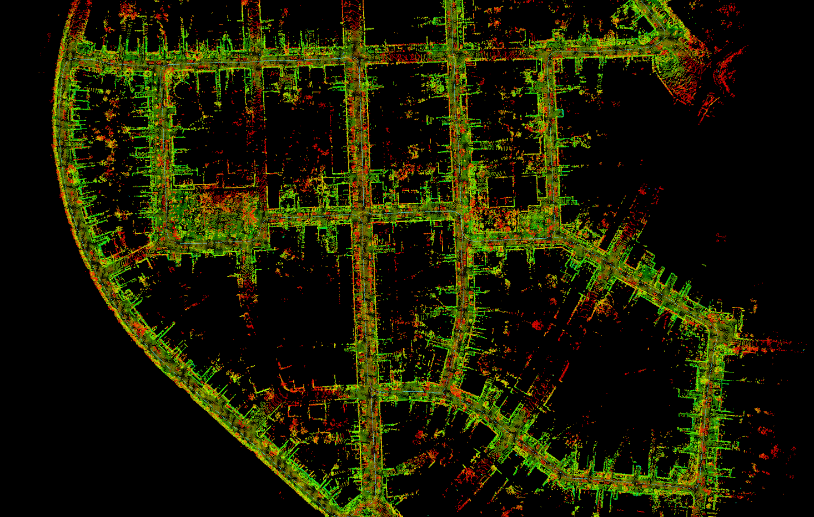
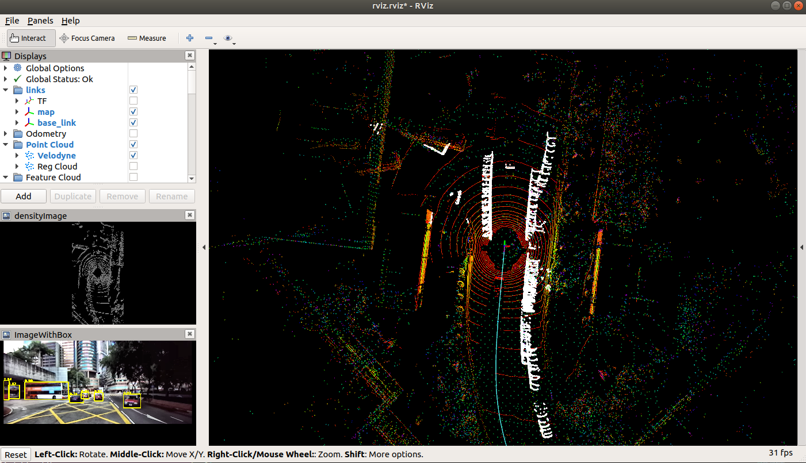
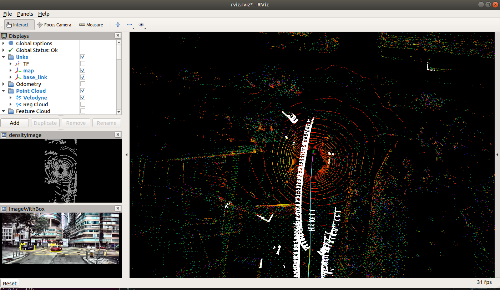
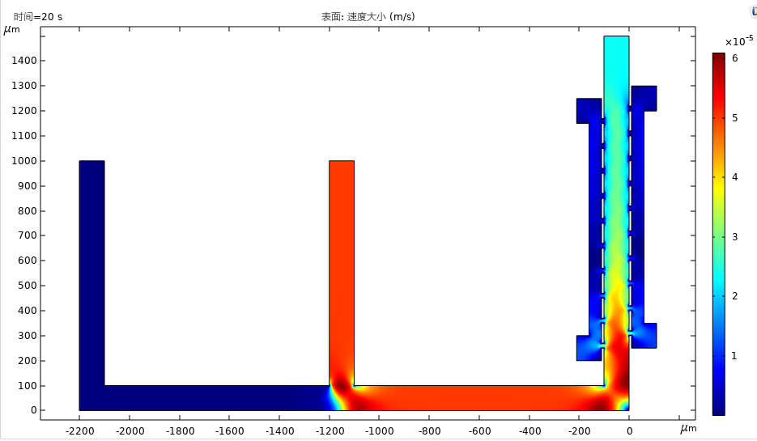
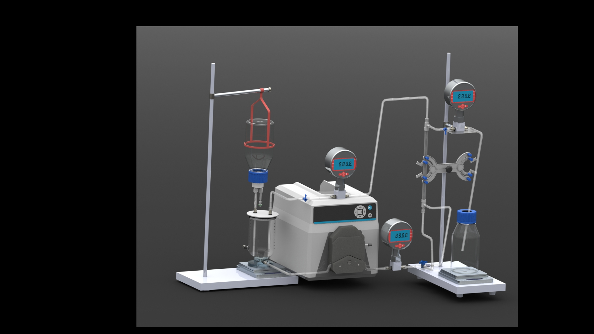

# 这是我的作品展示

## 1.	改进的系统在KITTI公共数据集下的建图效果

## 2.	改进的系统在UrbanHK公共数据集下的动态物体剔除效果（白色为动态点）

## 3.	改进的系统在KITTI公共数据集下的动态物体剔除效果
### 3.1 动态点剔除（加粗的点）

### 3.2 lidar点云语义判断

### 3.3 动态点剔除

## 4.	COMSOL多物理场仿真——层流+粒子流仿真

## 5.	SolidWorks个人作品

